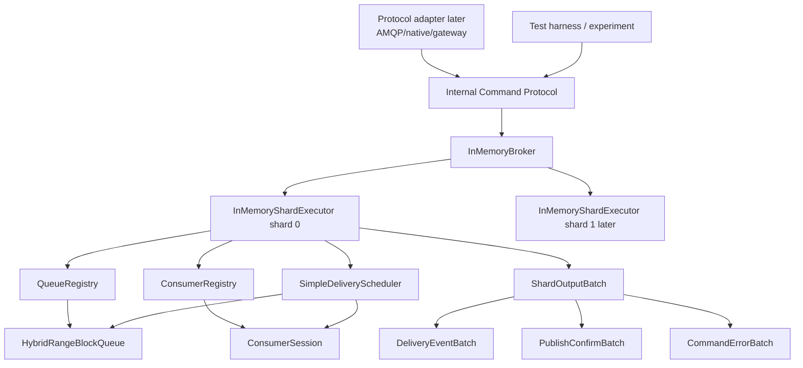

# AurumMQ PR5 — Single-Node In-Memory Broker Executor Plan

Status: design plan  
Target area: `crates/aurum-broker`, `crates/aurum-internal-protocol`, `crates/aurum-types`, and a new `experiments/h3-in-memory-broker` or `experiments/h4-in-memory-broker`.  
Depends on: PR2 model testing, PR3 Rabbit-like delivery semantics, and PR4 Internal Command Protocol.

---

## 1. Executive summary

PR5 is the first PR where AurumMQ starts behaving like a broker instead of a set of isolated libraries.

The goal is to build a **single-node, in-memory, deterministic broker executor** that receives internal command batches, executes them against `aurum-core`, and emits internal event/result batches.

No network.  
No AMQP parser.  
No native wire protocol.  
No durable storage.  
No cluster.  
No thread-per-core runtime yet.

The architecture validated in PR5 is:

```text
Internal Command Protocol
        ↓
InMemoryBroker / InMemoryShardExecutor
        ↓
QueueRegistry + ConsumerRegistry
        ↓
aurum-core::HybridRangeBlockQueue
+ aurum-core::ConsumerSession
        ↓
ShardOutputBatch
```

PR5 proves that PR4's command language can actually drive PR3's core semantics without leaking AMQP/native/storage concepts into `aurum-core`.

Core thesis:

> Before building transport, routing, storage, or clustering, AurumMQ must have an in-process executor that can publish, deliver, ack, nack, cancel, and confirm using only the internal protocol.

---

## 2. Why PR5 exists

PR1–PR3 gave us the local engine:

```text
HybridRangeBlockQueue
ConsumerSession
DeliveryWindow
Ack/Nack/Reject/Cancel semantics
Model/differential tests
```

PR4 defines the internal command/event boundary:

```text
PublishBatch
ConsumerCommandBatch
AckCommandBatch
NackCommandBatch
DeliveryEventBatch
PublishConfirmBatch
CommandErrorBatch
```

PR5 connects the two:

```text
CommandBatch -> broker execution -> core state transition -> EventBatch
```

Without PR5, adapters would be tempted to call `aurum-core` directly, or storage/routing would be built against assumptions that the command protocol does not actually satisfy.

PR5 is a **composition correctness PR**.

It answers:

```text
Can the internal protocol express enough information to run a broker?
Can aurum-broker translate commands into aurum-core operations cleanly?
Can delivery events be produced without protocol-specific types?
Can publish confirms and errors be modeled before storage exists?
Can we keep core independent from adapters and internal protocol?
```

---

## 3. Non-goals

PR5 must not implement these yet:

```text
AMQP frame parsing
Native TCP/QUIC protocol
Kafka/MQTT/STOMP gateways
Compiled routing by exchange/binding
Durable payload log
Queue index log
Ack ledger
io_uring
nio/glommio/monoio runtime
Thread-per-core worker model
NUMA placement
Replication/Raft/VSR
Kubernetes operator
Real authentication/authorization
DLX exchange routing
Timers / delayed retries
```

It may leave hooks for these, but it must not build them prematurely.

---

## 4. Current project state assumed

From the current workspace and prior PRs:

```text
crates/aurum-core
  queue/
    HybridRangeBlockQueue
    DeliveryRange / DeliveryMask
    AckRange / AckMask / NackMask
    NackReason
    ModelQueue
    invariant/model tests

  consumer/
    ConsumerSession<W = SegmentDeliveryWindow>
    ConsumerCredit / PrefetchMode
    DeliveryTag
    SessionDeliveryBatch
    TaggedDeliverySegment
    AckRequest / AckMode
    NackRequest / NackMode
    RejectRequest
    CancelDisposition
    ModelConsumerSession
    consumer model tests

crates/aurum-routing
  RouteTable
  QueueSet

crates/aurum-broker
  BrokerPrototype placeholder
```

PR4 should have introduced, or will introduce before PR5 execution, a crate similar to:

```text
crates/aurum-internal-protocol
```

If the actual codebase does not yet contain `aurum-internal-protocol`, PR5 must begin by finishing the relevant PR4 slices before implementing the executor.

---

## 5. High-level architecture



PR5 initially supports one shard, but its APIs must be **shard-ready**:

```text
one executor today
many executors tomorrow
```

That means every command/result that will later need ownership checks should carry enough IDs/epochs to be routed later, even if PR5 ignores most of them.

---

## 6. Key design rule

PR5 must preserve the dependency boundary:

```text
aurum-core
  must not depend on aurum-internal-protocol
  must not depend on aurum-broker
  must not depend on AMQP/native protocol crates

aurum-internal-protocol
  must not depend on aurum-core
  must not depend on AMQP/native protocol crates

aurum-broker
  may depend on aurum-core
  may depend on aurum-internal-protocol
  may depend on aurum-routing later
  composes everything
```

Correct direction:

```text
adapter -> internal protocol -> broker executor -> aurum-core
```

Wrong direction:

```text
adapter -> aurum-core directly
core -> internal protocol
core -> AMQP/native types
```

---

## 7. Static dispatch vs dynamic dispatch policy

PR5 must keep this rule explicit.

### 7.1 Hot path

Use:

```text
enums
generics
concrete structs
small fixed batches
SmallVec/ArrayVec where useful
bitflags for flags
```

Avoid:

```text
dyn Trait per command
dyn Trait per queue operation
Box<dyn Command>
Vec<Box<dyn Event>>
HashMap lookup per message where avoidable
```

The `InMemoryShardExecutor` should use concrete types:

```rust
pub struct InMemoryShardExecutor<W = SegmentDeliveryWindow> {
    // concrete registries
    // concrete queue engine
    // generic consumer window backend only if needed
}
```

If we want multiple delivery-window backends:

```rust
ConsumerSession<SegmentDeliveryWindow>
ConsumerSession<FixedPrefetchWindow>
```

not:

```rust
ConsumerSession<Box<dyn DeliveryWindowOps>>
```

### 7.2 Cold path

Dynamic dispatch is allowed later for:

```text
plugins
auth providers
management handlers
external adapters
operator integrations
observability sinks
```

PR5 is not building those.

### 7.3 Backend variation

If PR5 needs swappable internals, prefer enums in hot/warm paths:

```rust
pub enum QueueStorageBackend {
    InMemory,
    // Durable later
}
```

For cold/testing-only abstractions, traits are fine.

---

## 8. Enums and bitflags policy

The user preference is to model logic with enums and bitflags. PR5 should lean into that.

Use enums for **closed protocol/executor decisions**:

```rust
pub enum ShardCommandBatch {
    Publish(PublishBatch),
    Consumer(ConsumerCommandBatch),
    Ack(AckCommandBatch),
    Nack(NackCommandBatch),
    Cancel(CancelConsumerBatch),
}
```

Use enums for **semantic mode**:

```rust
pub enum ConfirmPolicy {
    None,
    Accepted,
    LocalDurableLater,
    QuorumLater,
}

pub enum SettlementOutcome {
    Acked,
    Requeued,
    Dropped,
    DeadLettered,
}
```

Use bitflags for **orthogonal state/options**:

```rust
bitflags::bitflags! {
    pub struct PublishFlags: u16 {
        const MANDATORY = 1 << 0;
        const PERSISTENT = 1 << 1;
        const CONFIRM_REQUESTED = 1 << 2;
        const ROUTED = 1 << 3;
    }
}

bitflags::bitflags! {
    pub struct DeliveryEventFlags: u16 {
        const REDELIVERED = 1 << 0;
        const PARTIAL_BATCH = 1 << 1;
    }
}
```

Avoid boolean soup:

```rust
persistent: bool,
mandatory: bool,
confirm: bool,
redelivered: bool,
```

Prefer flags.

---

## 9. Core concepts PR5 must introduce

### 9.1 `InMemoryBroker`

Responsible for owning one or more shard executors.

Initial version:

```rust
pub struct InMemoryBroker {
    shard: InMemoryShardExecutor,
}
```

Future-proof version:

```rust
pub struct InMemoryBroker {
    shards: Vec<InMemoryShardExecutor>,
}
```

PR5 can implement the single-shard version while keeping names/API shard-aware.

Responsibilities:

```text
receive command batches
route to shard executor by ShardId or QueueId shortcut
collect output batches
provide deterministic test harness API
```

Not responsible for:

```text
AMQP parsing
network I/O
storage fsync
compiled routing
real cluster routing
```

### 9.2 `InMemoryShardExecutor`

The main PR5 component.

Suggested module:

```text
crates/aurum-broker/src/in_memory/
  mod.rs
  broker.rs
  shard.rs
  registry.rs
  scheduler.rs
  output.rs
  error.rs
```

Suggested structure:

```rust
pub struct InMemoryShardExecutor {
    shard_id: ShardId,
    queues: QueueRegistry,
    consumers: ConsumerRegistry,
    scheduler: SimpleDeliveryScheduler,
    next_command_seq: u64,
}
```

Initial API:

```rust
impl InMemoryShardExecutor {
    pub fn new(shard_id: ShardId) -> Self;

    pub fn execute_batch(
        &mut self,
        batch: ShardCommandBatch,
        out: &mut ShardOutputBatch,
    );
}
```

Use `&mut ShardOutputBatch` to allow buffer reuse and avoid allocations in repeated tests.

### 9.3 `QueueRegistry`

Initial implementation can use `Vec` or `HashMap`.

Recommended PR5 version:

```rust
pub struct QueueRegistry {
    queues: Vec<QueueState>,
}
```

with simple dense IDs if possible.

If existing `QueueId(pub u32)` is dense, use:

```rust
queues[queue_id.0 as usize]
```

Fallback for sparse IDs:

```rust
hashbrown::HashMap<QueueId, QueueState>
```

Because PR5 is single-node and not the final hot runtime, `HashMap` is acceptable. But design the API so we can swap backend later.

Suggested API:

```rust
pub struct QueueState {
    pub id: QueueId,
    pub queue: HybridRangeBlockQueue,
    pub consumers: Vec<ConsumerId>,
    pub flags: QueueRuntimeFlags,
}

pub struct QueueRegistry {
    queues: HashMap<QueueId, QueueState>,
}
```

Future hot path can move to:

```text
dense queue table
per-shard queue slots
generational QueueHandle
```

### 9.4 `ConsumerRegistry`

Initial version:

```rust
pub struct ConsumerRegistry {
    consumers: HashMap<ConsumerId, ConsumerRuntimeState>,
}

pub struct ConsumerRuntimeState {
    pub queue_id: QueueId,
    pub session: ConsumerSession,
    pub flags: ConsumerRuntimeFlags,
}
```

Future version can become dense/indexed.

Consumer lookup is important for ack/nack. PR5 can use `HashMap`; later `ConsumerId` should probably be dense per shard.

### 9.5 `SimpleDeliveryScheduler`

PR5 scheduler is intentionally simple.

Initial policy:

```text
when publish arrives:
  try deliver to consumers for that queue

when credit increases:
  try deliver to that consumer/queue

when ack/nack releases credit:
  try deliver to that consumer/queue
```

Initial fairness:

```text
round-robin over queue.consumers
skip consumers with no credit
stop when no messages or no credit
```

No priority.  
No timing wheel.  
No global fair queue.  
No thread-per-core scheduler yet.

Suggested structure:

```rust
pub struct SimpleDeliveryScheduler {
    max_delivery_passes: u32,
}
```

Method:

```rust
pub fn drive_queue(
    &mut self,
    queue_id: QueueId,
    queues: &mut QueueRegistry,
    consumers: &mut ConsumerRegistry,
    out: &mut ShardOutputBatch,
);
```

Need careful borrow design: Rust borrow checker will dislike holding mutable references into both registries and queue at the same time. Possible approaches:

1. Collect consumer IDs first, then borrow queue/session one at a time.
2. Temporarily remove consumer from registry, operate, then insert back.
3. Store queue and consumers in separate vectors with index-based access.

For PR5, prefer simple approach:

```text
clone/copy consumer IDs into small temporary Vec
for each consumer_id:
  borrow queue mut
  borrow consumer mut
  deliver
```

If borrow conflicts appear, split functions around scopes instead of adding unsafe.

---

## 10. Internal protocol assumptions

PR5 should assume PR4 provides command/event types conceptually similar to the following.

If names differ, adapt the plan to the actual names, but keep the semantics.

### 10.1 Commands

```rust
pub enum ShardCommandBatch {
    Publish(PublishBatch),
    Consumer(ConsumerCommandBatch),
    Ack(AckCommandBatch),
    Nack(NackCommandBatch),
    Cancel(CancelConsumerBatch),
}
```

### 10.2 Publish

```rust
pub struct PublishBatch {
    pub source: CommandSource,
    pub queue_id: QueueId,
    pub publish_seq_base: u64,
    pub flags: PublishFlags,
    pub messages: MessageDescriptorBatch,
}
```

For PR5, payload bytes do not matter. We need message count and correlation metadata.

Use a payload descriptor, not owned payload bytes:

```rust
pub enum PayloadHandle {
    Empty,
    InlineSmall { offset: u32, len: u32 },
    External { id: u64, len: u32 },
}
```

PR5 can use `Empty` or `External` placeholders.

### 10.3 Consumers

```rust
pub enum ConsumerCommand {
    DeclareQueue { queue_id: QueueId, initial_messages: u64 },
    CreateConsumer { consumer_id: ConsumerId, channel_id: ChannelId, queue_id: QueueId, prefetch: PrefetchMode },
    CreditUpdate { consumer_id: ConsumerId, credit: CreditDelta },
}
```

Whether declaration lives in PR5 or PR6 is flexible. PR5 needs some way to create a queue.

### 10.4 Settlement

```rust
pub struct AckCommandBatch {
    pub consumer_id: ConsumerId,
    pub mode: AckMode,
    pub tags: SmallVec<[DeliveryTag; 8]>,
}

pub struct NackCommandBatch {
    pub consumer_id: ConsumerId,
    pub mode: NackMode,
    pub reason: NackReason,
    pub tags: SmallVec<[DeliveryTag; 8]>,
}
```

Alternative:

```rust
pub enum SettlementCommand {
    AckOne { tag },
    AckMultiple { tag },
    NackOne { tag, reason },
    NackMultiple { tag, reason },
}
```

For hot batch processing, prefer batches grouped by consumer and mode.

### 10.5 Events

```rust
pub struct ShardOutputBatch {
    pub deliveries: DeliveryEventBatch,
    pub confirms: PublishConfirmBatch,
    pub settlements: SettlementResultBatch,
    pub errors: CommandErrorBatch,
}
```

Delivery events should carry protocol-neutral delivery segments:

```rust
pub struct DeliveryEvent {
    pub queue_id: QueueId,
    pub consumer_id: ConsumerId,
    pub channel_id: ChannelId,
    pub first_tag: DeliveryTag,
    pub segment: DeliveredSegmentRef,
    pub flags: DeliveryEventFlags,
}
```

Where `DeliveredSegmentRef` mirrors `aurum-core` output without depending on `aurum-core` types if possible. Since `DeliveryRange` and `DeliveryMask` already live in `aurum-types`, reuse those.

---

## 11. PR5 dependency direction

`aurum-broker` will depend on:

```text
aurum-types
aurum-core
aurum-routing later
aurum-internal-protocol
aurum-plugin-api maybe later
```

`aurum-broker` may translate:

```text
aurum-internal-protocol::AckCommandBatch
  -> aurum-core::AckRequest
  -> aurum-core::AckBatch internally
```

But `aurum-core` must remain ignorant of command protocol types.

---

## 12. Proposed file structure

```text
crates/aurum-broker/
  src/
    lib.rs
    in_memory/
      mod.rs
      broker.rs
      shard.rs
      registry.rs
      scheduler.rs
      output.rs
      error.rs
      tests.rs

experiments/
  h3-in-memory-broker/
    Cargo.toml
    src/main.rs
```

If the workspace already has `h3-command-protocol`, either extend it or create `h4-in-memory-broker`. Prefer a name that reflects the actual PR:

```text
h3-in-memory-broker
```

or

```text
h4-in-memory-broker
```

Consistency matters less than clarity.

---

## 13. Slice plan

## Slice 0 — Preflight and PR4 compatibility

Goal: ensure PR4's internal protocol crate is ready for PR5.

Checklist:

```text
[ ] `crates/aurum-internal-protocol` exists.
[ ] Workspace includes it.
[ ] `aurum-broker` depends on it.
[ ] Command/event batch skeletons exist.
[ ] IDs needed by command protocol are in `aurum-types` or exported neutrally.
[ ] `cargo check --workspace --all-targets` passes.
```

If PR4 is only documented but not implemented, implement the minimal subset needed for PR5 first.

Minimal subset:

```text
PublishBatch
ConsumerCommandBatch
AckCommandBatch
NackCommandBatch
CancelConsumerBatch
ShardCommandBatch
DeliveryEventBatch
PublishConfirmBatch
CommandErrorBatch
ShardOutputBatch
```

---

## Slice 1 — InMemoryShardExecutor skeleton

Goal: create the executor shape without implementing all commands.

Files:

```text
crates/aurum-broker/src/in_memory/mod.rs
crates/aurum-broker/src/in_memory/shard.rs
crates/aurum-broker/src/in_memory/output.rs
crates/aurum-broker/src/in_memory/error.rs
```

API:

```rust
pub struct InMemoryShardExecutor {
    shard_id: ShardId,
    queues: QueueRegistry,
    consumers: ConsumerRegistry,
    scheduler: SimpleDeliveryScheduler,
}

impl InMemoryShardExecutor {
    pub fn new(shard_id: ShardId) -> Self;

    pub fn execute_batch(
        &mut self,
        batch: ShardCommandBatch,
        out: &mut ShardOutputBatch,
    );
}
```

Tests:

```text
executor_starts_empty
unknown_queue_publish_returns_error
unknown_consumer_ack_returns_error
```

Design note:

`execute_batch` should not panic on invalid commands. It should append to `CommandErrorBatch`.

---

## Slice 2 — Queue declaration / QueueRegistry

Goal: have in-memory queues that can be created and looked up.

Files:

```text
registry.rs
```

Structures:

```rust
pub struct QueueRegistry {
    queues: HashMap<QueueId, QueueState>,
}

pub struct QueueState {
    id: QueueId,
    queue: HybridRangeBlockQueue,
    consumers: Vec<ConsumerId>,
    flags: QueueRuntimeFlags,
}
```

Flags:

```rust
bitflags::bitflags! {
    pub struct QueueRuntimeFlags: u16 {
        const ACTIVE = 1 << 0;
        const DELETING = 1 << 1;
    }
}
```

Operations:

```rust
create_queue(queue_id)
get_queue(queue_id)
get_queue_mut(queue_id)
attach_consumer(queue_id, consumer_id)
detach_consumer(queue_id, consumer_id)
```

Tests:

```text
create_queue_once
create_queue_duplicate_errors
lookup_unknown_queue_errors
attach_detach_consumer
```

Design decision:

Use `HashMap` or `hashbrown::HashMap` in PR5; do not prematurely build a dense arena unless existing IDs are dense and simple.

---

## Slice 3 — Publish execution

Goal: `PublishBatch` creates messages in a queue and produces confirms.

Execution:

```text
CommandBatch::Publish(batch)
  -> validate queue exists
  -> count messages
  -> queue.publish_contiguous(count)
  -> append PublishConfirm entries
  -> run scheduler for that queue
```

Confirm semantics in PR5:

```text
Confirm means accepted by in-memory queue.
Not durable.
Not replicated.
```

Model this explicitly:

```rust
pub enum PublishConfirmStatus {
    AcceptedInMemory,
    Rejected,
}
```

Confirm event should include enough correlation metadata for adapters later:

```rust
pub struct PublishConfirm {
    pub source: CommandSource,
    pub publish_seq: u64,
    pub status: PublishConfirmStatus,
}
```

Tests:

```text
publish_to_existing_queue_increases_ready_count
publish_to_unknown_queue_emits_error
publish_confirm_count_matches_message_count
publish_triggers_delivery_when_consumer_has_credit
```

Important:

Do not store payload bytes yet. PR5 only needs message count and metadata descriptors.

---

## Slice 4 — Consumer creation and credit

Goal: create consumers and allow delivery through `ConsumerSession`.

Consumer state:

```rust
pub struct ConsumerRuntimeState {
    pub queue_id: QueueId,
    pub session: ConsumerSession,
    pub flags: ConsumerRuntimeFlags,
}
```

Flags:

```rust
bitflags::bitflags! {
    pub struct ConsumerRuntimeFlags: u16 {
        const ACTIVE = 1 << 0;
        const CANCELLED = 1 << 1;
        const DRAINING = 1 << 2;
    }
}
```

Commands:

```text
CreateConsumer
CreditUpdate
CancelConsumer later slice
```

For PR5, `CreateConsumer` can set initial prefetch. Credit can be entirely represented by prefetch in `ConsumerSession`; if PR4 already models explicit credit deltas, map them to session behavior carefully.

Tests:

```text
create_consumer_attaches_to_queue
prefetch_limits_delivery
credit_update_triggers_delivery
consumer_on_unknown_queue_errors
```

---

## Slice 5 — Delivery scheduler

Goal: produce delivery events when messages and credit are available.

Initial scheduler rules:

```text
For a queue:
  iterate consumers in stable round-robin order
  call session.deliver_from_queue(queue, max, out)
  convert SessionDeliveryBatch into DeliveryEventBatch
  stop when no messages delivered in a full pass
```

Round-robin state:

```rust
pub struct QueueState {
    consumers: Vec<ConsumerId>,
    next_consumer_index: usize,
    // ...
}
```

Avoid complex borrow conflicts by extracting IDs:

```text
1. Copy consumer IDs for a pass.
2. For each consumer ID:
   - borrow consumer mut briefly
   - borrow queue mut briefly
   - call deliver
   - append events
3. Drop borrows between iterations.
```

Delivery event conversion:

`ConsumerSession` returns:

```text
SessionDeliveryBatch
  TaggedDeliverySegment::Range
  TaggedDeliverySegment::Mask
```

`aurum-broker` converts to protocol-neutral events:

```text
DeliveryEventBatch
  queue_id
  consumer_id
  channel_id
  first_tag
  DeliveryRange/DeliveryMask
  flags
```

Tests:

```text
delivery_event_contains_consumer_id_queue_id_and_tag
delivery_preserves_range_segments
delivery_preserves_mask_segments_after_requeue
round_robin_two_consumers
no_delivery_without_credit
```

Performance policy:

Do not over-optimize scheduler yet. It is intentionally simple. The final scheduler belongs to `aurum-runtime`/shard runtime later.

---

## Slice 6 — Ack execution

Goal: route `AckCommandBatch` to `ConsumerSession::ack` and produce settlement results.

Execution:

```text
AckCommandBatch
  -> lookup consumer
  -> for each ack command or batch group
  -> ConsumerSession::ack(req, queue)
  -> append AckResult event
  -> run scheduler for consumer's queue
```

Need queue lookup via consumer's `queue_id`.

Result event:

```rust
pub struct SettlementResult {
    pub consumer_id: ConsumerId,
    pub kind: SettlementKind,
    pub settled: u32,
    pub released_credit: u32,
}
```

Enums:

```rust
pub enum SettlementKind {
    Ack,
    Nack,
    Reject,
    Cancel,
}
```

Tests:

```text
ack_one_releases_credit_and_triggers_more_delivery
ack_multiple_settles_all_tags_up_to_tag
ack_unknown_consumer_errors
ack_invalid_tag_errors
ack_after_cancel_errors
```

Important:

Do not emit protocol-level channel-close behavior here. Emit internal error codes; AMQP adapter later maps them to channel errors.

---

## Slice 7 — Nack/reject execution

Goal: support requeue/drop/dead-letter placeholder through command protocol.

Execution:

```text
NackCommandBatch
  -> lookup consumer
  -> ConsumerSession::nack(req, queue)
  -> append settlement result
  -> if requeued, run scheduler
```

Nack reasons:

```text
Requeue
Reject / Drop
DeadLetter placeholder
```

Tests:

```text
nack_requeue_redelivers_with_redelivery_flag
nack_reject_drops_message_placeholder
nack_dead_letter_counts_dead_lettered_placeholder
nack_multiple_requeues_multiple_tags
nack_invalid_tag_errors
```

Design:

Dead-letter is not real DLX yet. PR5 only tracks the outcome. Real DLX routing comes after compiled routing/storage decisions.

---

## Slice 8 — Consumer cancel

Goal: model disconnect/cancel behavior.

Execution:

```text
CancelConsumerBatch
  -> lookup consumer
  -> ConsumerSession::cancel(disposition, queue)
  -> detach from queue
  -> mark/remove consumer
  -> if requeued, run scheduler for queue
```

Policies:

```rust
pub enum CancelDisposition {
    RequeueUnacked,
    DropUnacked,
}
```

Tests:

```text
cancel_requeue_unacked_redelivers_to_other_consumer
cancel_drop_unacked_removes_messages
cancel_unknown_consumer_errors
cancel_twice_is_error_or_idempotent_by_policy
```

Decision needed:

```text
Should cancel be idempotent?
```

Recommended PR5 policy:

```text
Cancel existing active consumer: success.
Cancel already-cancelled/unknown consumer: error.
```

AMQP adapter can later choose how to map duplicate cancel.

---

## Slice 9 — `InMemoryBroker` facade

Goal: one convenient testing API above shard executor.

Structure:

```rust
pub struct InMemoryBroker {
    shard: InMemoryShardExecutor,
}
```

API:

```rust
impl InMemoryBroker {
    pub fn single_shard() -> Self;

    pub fn execute(&mut self, batch: ShardCommandBatch) -> ShardOutputBatch;
}
```

Testing helpers behind `#[cfg(test)]` or a `testing` feature:

```rust
pub fn create_queue(&mut self, queue_id: QueueId);
pub fn create_consumer(...);
pub fn publish_count(...);
```

Avoid making testing helpers part of stable API if they are too convenient and bypass command protocol.

---

## Slice 10 — Experiment harness

Create:

```text
experiments/h3-in-memory-broker
```

Workloads:

```text
publish_deliver_ack
publish_deliver_ack_multiple
publish_nack_requeue_ack
consumer_cancel_requeue
multi_consumer_round_robin
```

CLI flags:

```text
--messages
--batch
--prefetch
--consumers
--workload
```

Example:

```bash
cargo run --release -p h3-in-memory-broker -- \
  --messages=4194304 \
  --batch=128 \
  --prefetch=128 \
  --consumers=1 \
  --workload=publish_deliver_ack
```

Metrics printed:

```text
elapsed_ms
ns_per_msg
published
confirmed
delivered
acked
nacked
redelivered
errors
checksum
```

Optional later with perf:

```bash
perf stat -e cycles,instructions,branches,branch-misses,cache-misses,LLC-load-misses ...
```

---

## 14. Error model

PR5 should centralize errors into protocol-neutral codes.

Examples:

```rust
pub enum BrokerCommandErrorKind {
    UnknownQueue,
    DuplicateQueue,
    UnknownConsumer,
    DuplicateConsumer,
    ConsumerCancelled,
    InvalidDeliveryTag,
    QueueInvariantViolation,
    InternalCoreError,
    UnsupportedCommand,
}
```

Error event:

```rust
pub struct CommandError {
    pub source: CommandSource,
    pub kind: BrokerCommandErrorKind,
    pub queue_id: Option<QueueId>,
    pub consumer_id: Option<ConsumerId>,
    pub command_seq: Option<u64>,
}
```

No panics for command errors.

Panics/asserts are only allowed for programmer invariants in tests/debug, not user-command-invalid conditions.

---

## 15. Output batching strategy

Avoid returning one allocation-heavy event per message in the internal broker.

Use segmented outputs:

```text
DeliveryEventBatch:
  Vec/SmallVec of delivery segments

PublishConfirmBatch:
  ranges where possible

SettlementResultBatch:
  one result per settlement command group
```

PR5 may use `Vec` first, but structure the APIs so `SmallVec`/`ArrayVec` can replace common small vectors later.

Recommended:

```rust
pub struct ShardOutputBatch {
    pub deliveries: DeliveryEventBatch,
    pub confirms: PublishConfirmBatch,
    pub settlements: SettlementResultBatch,
    pub errors: CommandErrorBatch,
}

impl ShardOutputBatch {
    pub fn clear(&mut self);
}
```

Use reusable output buffers in executor experiments.

---

## 16. Scalability decisions baked into PR5

Even though PR5 is single-node/in-memory, design it so scaling later does not require rewriting.

### 16.1 Shard-aware from day one

Every executor has a `ShardId`.

Every command batch that is shard-targeted should either carry a `ShardId` or be in a shard-specific envelope.

Do not name things `BrokerCommand` if they are really `ShardCommand`.

### 16.2 Queue ownership

A queue belongs to exactly one shard executor in PR5.

Later:

```text
queue logical name -> queue shards -> shard executors
```

PR5 should not build global mutable queue state.

### 16.3 Consumer ownership

A consumer session is owned by one shard executor.

AMQP/native adapters later may connect to any node, but the internal command must reach the owning shard.

PR5 should enforce:

```text
consumer_id lookup is local to executor
```

### 16.4 Epoch hooks

If PR4 introduced epochs, keep fields in commands/events even if PR5 does not fully validate them.

```text
route_epoch
shard_epoch
queue_generation
```

PR5 can check equality with a default value or ignore under a documented `InMemoryEpochPolicy`.

### 16.5 No central singleton

Avoid a global `static mut Broker` or global registries. The executor should be regular state passed by `&mut self`.

This makes future deterministic simulation easier.

---

## 17. Borrowing strategy in Rust

The main implementation challenge will be borrowing queue and consumer state at the same time.

Bad direction:

```rust
let queue = self.queues.get_mut(queue_id);
let consumer = self.consumers.get_mut(consumer_id);
consumer.session.deliver_from_queue(&mut queue.queue, ...);
```

This may be okay if registries are separate fields, but scheduler loops that borrow both repeatedly can get complicated.

Recommended pattern:

```rust
fn drive_consumer(&mut self, consumer_id: ConsumerId, out: &mut ShardOutputBatch) {
    let queue_id = self.consumers.queue_id(consumer_id)?;

    {
        let queue = self.queues.get_mut(queue_id)?;
        let consumer = self.consumers.get_mut(consumer_id)?;
        consumer.session.deliver_from_queue(&mut queue.queue, ...);
    }
}
```

If Rust rejects simultaneous mutable borrows of two fields, add helper methods that split borrows:

```rust
let Self { queues, consumers, scheduler, .. } = self;
```

Or use temporary removal:

```rust
let mut consumer = consumers.remove(consumer_id)?;
let queue = queues.get_mut(queue_id)?;
// operate
consumers.insert(consumer_id, consumer);
```

Avoid `RefCell` in the executor.  
Avoid unsafe.  
Avoid `Rc<RefCell<_>>`.

---

## 18. Testing plan

### 18.1 Unit tests

```text
queue_registry_create_lookup
consumer_registry_create_lookup
publish_to_unknown_queue_errors
publish_confirm_count_matches
consumer_create_unknown_queue_errors
prefetch_limits_delivery
ack_one_releases_credit
ack_multiple_delivers_more
nack_requeue_redelivers
cancel_requeue_to_second_consumer
```

### 18.2 End-to-end in-memory tests

Use command batches only.

```text
create queue
create consumer
publish N
observe delivery events
ack delivery tags
observe more delivery events
assert counts
```

No direct calls to `HybridRangeBlockQueue` in these E2E tests.

### 18.3 Differential-style executor tests

Optional PR5.1:

Build a simple model executor:

```text
ModelInMemoryBroker
  ModelQueue
  ModelConsumerSession
```

Compare against real executor under randomized command sequences.

This is useful but can be deferred if PR5 is already large. At minimum, deterministic command tests are required.

### 18.4 Error tests

Every user-command error must produce `CommandErrorBatch`, not panic.

```text
unknown queue
unknown consumer
invalid tag
duplicate consumer
duplicate queue
cancelled consumer ack
```

---

## 19. Benchmark plan

PR5 benchmarks are not final performance truth. They validate overhead of command protocol + broker executor.

Benchmarks:

```text
publish_only_in_memory
publish_deliver_ack
publish_deliver_ack_multiple
publish_nack_requeue_ack
multi_consumer_round_robin
```

Compare against H1/H2 direct core benchmarks.

Expected result:

```text
PR5 executor slower than direct core benchmark, but not catastrophically slower.
```

Red flags:

```text
>2x overhead over direct core for simple deliver_ack due only to command/event wrapping
allocations per message in normal path
one event object per message when range/mask could represent many
HashMap lookup per message instead of per batch/consumer operation
```

Important metric:

```text
ns/message through executor
allocations/message if measured
segments/message
commands/message
```

---

## 20. Acceptance criteria

PR5 is done when:

```text
[ ] `InMemoryShardExecutor` exists.
[ ] `InMemoryBroker` facade exists.
[ ] Queues can be declared/created in memory.
[ ] Consumers can be created and attached to queues.
[ ] PublishBatch inserts messages into queue.
[ ] PublishConfirmBatch is emitted.
[ ] DeliveryEventBatch is emitted using range/mask delivery segments.
[ ] AckCommandBatch settles delivery tags through ConsumerSession.
[ ] NackCommandBatch supports requeue/drop/dead-letter placeholder.
[ ] CancelConsumer requeues or drops unacked messages according to disposition.
[ ] Errors are reported as CommandErrorBatch.
[ ] No protocol-specific types appear in `aurum-core`.
[ ] `aurum-core` does not depend on `aurum-internal-protocol`.
[ ] `aurum-internal-protocol` does not depend on `aurum-core`.
[ ] `cargo test --workspace` passes.
[ ] New in-memory broker experiment runs.
[ ] README/docs updated.
```

---

## 21. PR5 deliverables

Code:

```text
crates/aurum-broker/src/in_memory/*
experiments/h3-in-memory-broker/*
```

Potential supporting changes:

```text
crates/aurum-internal-protocol/src/event/*
crates/aurum-internal-protocol/src/command/*
crates/aurum-types/src/lib.rs
```

Docs:

```text
docs/AURUM_BROKER_PR5_IN_MEMORY_EXECUTOR_PLAN.md
README.md update
```

Tests:

```text
crates/aurum-broker/tests/in_memory_executor.rs
```

or module tests under:

```text
crates/aurum-broker/src/in_memory/tests.rs
```

---

## 22. Risks and design traps

### 22.1 Accidentally making PR5 protocol-shaped

Bad:

```rust
AmqpBasicAckCommand
AmqpChannelId
AmqpDeliveryFrame
```

Good:

```rust
AckCommandBatch
ChannelId // neutral
DeliveryEventBatch
```

### 22.2 Per-message event explosion

Bad:

```text
one DeliveryEvent per message
```

Good:

```text
one DeliveryEvent per range/mask segment
```

### 22.3 Registry design becoming final too early

PR5 registries can be simple. Do not over-design dense arenas unless needed. But hide registry internals behind methods so we can swap implementation later.

### 22.4 Scheduler becoming too ambitious

PR5 scheduler is not final. It should validate command-to-core flow, not solve global fairness.

### 22.5 Mixing storage semantics into confirms

In PR5, confirm means `AcceptedInMemory`. Do not pretend it is durable.

Future confirm modes:

```text
AcceptedInMemory
LocalDurable
QuorumDurable
Rejected
```

### 22.6 Pulling in dynamic dispatch

Do not build:

```rust
Vec<Box<dyn CommandHandler>>
```

Use enums and match dispatch.

---

## 23. Suggested implementation order

Recommended commit sequence:

```text
1. Add/finish minimal internal protocol types needed by PR5.
2. Add `in_memory` module skeleton in `aurum-broker`.
3. Implement QueueRegistry + tests.
4. Implement ConsumerRegistry + tests.
5. Implement publish -> confirm.
6. Implement create consumer + scheduler delivery events.
7. Implement ack -> settlement result + drive scheduler.
8. Implement nack/reject.
9. Implement cancel.
10. Add end-to-end command tests.
11. Add h3-in-memory-broker experiment.
12. Run workspace tests and benchmark sanity.
13. Update README.
```

---

## 24. Example flow to validate

### 24.1 Command sequence

```text
DeclareQueue(q1)
CreateConsumer(c1, q1, prefetch=128)
PublishBatch(q1, count=1000, confirm=true)
AckMultiple(c1, tag=128)
AckMultiple(c1, tag=256)
NackOne(c1, tag=300, requeue=true)
CancelConsumer(c1, requeue_unacked=true)
```

### 24.2 Expected effects

```text
queue has 1000 messages accepted
first delivery emits up to 128 messages
ack multiple frees credit
scheduler emits more deliveries
nack requeue marks redelivered on next delivery
cancel requeues all remaining unacked
```

### 24.3 Expected outputs

```text
PublishConfirmBatch(count=1000, status=AcceptedInMemory)
DeliveryEventBatch(range/mask segments)
SettlementResultBatch(acked/nacked/requeued counts)
CommandErrorBatch(empty)
```

---

## 25. What PR5 unlocks

After PR5, we can move to:

```text
PR6 — Compiled routing minimum
  direct exchange
  route_id
  QueueSet grouped by queue/shard

PR7 — Native protocol minimum
  resolve_route
  publish_batch
  consume_start
  ack_batch
  nack_batch

PR8 — Append-only storage initial
  payload log
  queue index
  ack ledger
  in-memory executor gains storage hooks

PR9 — AMQP adapter initial
  basic.publish
  basic.consume
  basic.ack
  basic.nack
  qos/prefetch
```

PR5 is the bridge between a correct local core and a real broker architecture.

---

## 26. Final design statement

PR5 should make this true:

> AurumMQ can execute its own internal command protocol against `aurum-core` in a deterministic single-node in-memory broker, producing protocol-neutral delivery, confirmation, settlement, and error batches without depending on AMQP, native transport, storage, or clustering.

If PR5 succeeds, later protocol adapters become thin translators, not business logic owners.
