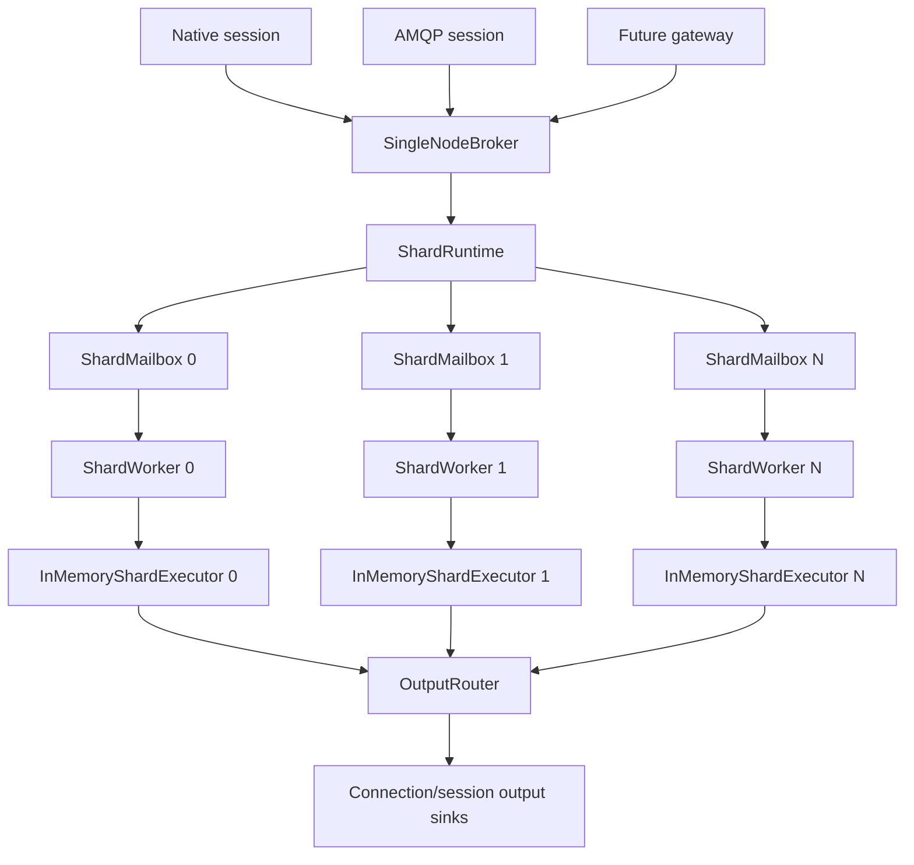

# PR11 — Single-Node Thread-Per-Core Runtime and Shard Mailboxes

## 0. Status and intent

PR10 introduced the first networked single-node broker server. PR11 is the next architectural step: move from a direct in-memory executor call model to a real **single-node shard runtime**.

The goal is **not** clustering yet. The goal is to make one process behave like the future distributed broker internally:

```text
protocol sessions
    ↓
CommandBatch
    ↓
shard mailbox
    ↓
owner shard worker
    ↓
aurum-core queue engine + consumer sessions
    ↓
BrokerOutputBatch / DeliveryEventBatch / confirms / errors
    ↓
connection output sinks
```

This PR is the foundation for:

```text
PR12: NUMA-aware placement and runtime tuning
PR13: durable recovery integration hardening
PR14: multi-shard compiled routing refinements
PR15+: clustering / replication / shard movement
```

PR11 must preserve all established architectural boundaries:

```text
aurum-core does not know protocols, storage, routing, runtime, cluster, or AMQP.
aurum-internal-protocol does not know protocol wire formats.
aurum-protocol-native and aurum-protocol-amqp do not call aurum-core directly.
aurum-broker composes protocol sessions, routing, runtime, executor, storage, and output events.
```

---

## 1. Problem statement

PR5/PR10 can execute commands against an in-memory broker, but the executor is still conceptually direct and centralized. That is not the final shape of AurumMQ.

The final design needs:

```text
1. One owner per shard.
2. No shared mutable queue state across workers.
3. Command batches routed to the owner shard.
4. Output events routed back to the originating connection/session.
5. Backpressure on mailboxes.
6. Runtime backends that can evolve from manual threads to nio/glommio/monoio/io_uring.
7. A model that later supports NUMA, shard migration, leader transfer, and clustering.
```

PR11 turns the single-node broker into a **local distributed system**: multiple shards, mailboxes, workers, output sinks, and deterministic stop/drain semantics.

---

## 2. PR11 objective

Implement a minimal but production-shaped shard runtime for a single process:

```text
SingleNodeBroker
    ↓
ShardRuntime
    ↓
ShardWorker[N]
    ↓
ShardMailbox[N]
    ↓
InMemoryShardExecutor per shard
```

The runtime must process `CommandBatch` values asynchronously or quasi-asynchronously through mailboxes rather than direct executor calls.

### Concrete objective

After PR11, this should work:

```text
1. Start a single-node broker with N shards/workers.
2. Create queues assigned to specific shards.
3. Publish commands are routed to the correct shard mailbox.
4. Consumer commands are routed to the owning shard.
5. Ack/nack/cancel commands are routed using ConsumerId/session metadata.
6. Each shard owns its QueueRegistry and ConsumerRegistry.
7. Each shard emits BrokerOutputBatch values to a broker-level output router.
8. Native/AMQP protocol sessions can still be attached later without touching shard internals.
```

---

## 3. Non-goals

PR11 must **not** implement:

```text
cluster membership
Raft/VSR/replication
cross-node routing
real NUMA policy enforcement
io_uring storage integration
full async runtime replacement
Kafka gateway
AMQP semantic expansion
DLX real routing
multi-region topology
Kubernetes/operator work
```

PR11 may create hooks/placeholders for those, but no full implementation.

---

## 4. Target architecture



The key idea:

```text
Protocol sessions submit command batches.
Shard runtime routes them to owner shards.
Shard workers execute them locally.
Output router returns events to protocol/session owners.
```

---

## 5. Crate impact

### 5.1 `aurum-runtime`

This PR primarily creates the real runtime abstraction here.

Expected modules:

```text
crates/hot-path/aurum-runtime/src/
  lib.rs
  core_id.rs
  worker_id.rs
  shard_worker.rs
  shard_runtime.rs
  mailbox.rs
  output.rs
  budget.rs
  lifecycle.rs
  backend/
    mod.rs
    manual.rs
    nio.rs          # optional feature / skeleton only
  tests/
```

### 5.2 `aurum-concurrency`

May receive or expose mailbox primitives:

```text
bounded_spsc
mpsc_lanes
cache_padded
backoff
```

For PR11, keep this simple. A safe `std::sync::mpsc` or `crossbeam-channel` backed implementation can be acceptable as a **backend**, but the public runtime abstraction must not depend on one channel library permanently.

### 5.3 `aurum-broker`

`SingleNodeBroker` should stop being only a direct executor facade and start owning:

```text
ShardRuntime
ShardPlacement / queue -> shard map
OutputRouter
SessionOutputRegistry
```

### 5.4 `aurum-internal-protocol`

May need small additions:

```text
CommandEnvelope
CommandOrigin
ConnectionId
SessionId
RequestId
OutputTarget
ShardTarget
```

Avoid bloating this crate. It should define neutral protocol structs, not runtime implementation.

### 5.5 `aurum-routing`

PR6 route targets should connect naturally to runtime shard targets:

```text
QueueTarget { shard_id, queue_id }
RouteId -> QueueSet grouped by ShardId
```

PR11 should not redesign routing, but it should make the broker route `QueueTarget` to mailbox `ShardId`.

---

## 6. Core types

### 6.1 Worker identity

```rust
#[repr(transparent)]
#[derive(Clone, Copy, Debug, PartialEq, Eq, Hash)]
pub struct WorkerId(pub u32);

#[repr(transparent)]
#[derive(Clone, Copy, Debug, PartialEq, Eq, Hash)]
pub struct CoreId(pub u32);
```

Future NUMA extension:

```rust
#[repr(transparent)]
#[derive(Clone, Copy, Debug, PartialEq, Eq, Hash)]
pub struct NumaNodeId(pub u16);
```

Do not overbuild NUMA in PR11, but keep type room for PR12.

### 6.2 Shard identity

Use existing `ShardId` if already defined in `aurum-types`. Do not duplicate it.

If a type is missing, add it to `aurum-types`:

```rust
#[repr(transparent)]
#[derive(Clone, Copy, Debug, PartialEq, Eq, Hash, PartialOrd, Ord)]
pub struct ShardId(pub u32);
```

### 6.3 Command origin

Every command batch needs enough metadata to route results back:

```rust
#[derive(Clone, Copy, Debug, PartialEq, Eq, Hash)]
pub struct ConnectionId(pub u64);

#[derive(Clone, Copy, Debug, PartialEq, Eq, Hash)]
pub struct SessionId(pub u64);

#[derive(Clone, Copy, Debug, PartialEq, Eq, Hash)]
pub struct RequestId(pub u64);
```

Use a compact origin object:

```rust
#[derive(Clone, Copy, Debug, PartialEq, Eq)]
pub struct CommandOrigin {
    pub connection_id: ConnectionId,
    pub session_id: SessionId,
    pub request_id: RequestId,
}
```

### 6.4 Command envelope

Do not force every `CommandBatch` variant to carry origin separately.

Recommended:

```rust
pub struct CommandEnvelope {
    pub origin: CommandOrigin,
    pub target: ShardTarget,
    pub batch: CommandBatch,
    pub flags: CommandEnvelopeFlags,
}
```

`ShardTarget`:

```rust
pub enum ShardTarget {
    Direct(ShardId),
    Queue(QueueId),
    Route(RouteId),
    BroadcastControl,
}
```

PR11 should primarily support `Direct(ShardId)` and `Queue(QueueId)`.

`Route(RouteId)` can call routing if PR6 is ready.

### 6.5 Output envelope

Shard outputs also need origin/target metadata:

```rust
pub struct OutputEnvelope {
    pub origin: CommandOrigin,
    pub source_shard: ShardId,
    pub batch: BrokerOutputBatch,
    pub flags: OutputEnvelopeFlags,
}
```

This avoids protocol adapters needing to inspect shard internals.

---

## 7. Batch shape and hot-path dispatch

### 7.1 Avoid command-per-message

Never design runtime mailboxes as:

```rust
Vec<SingleMessageCommand>
```

Use:

```rust
CommandEnvelope { batch: CommandBatch::Publish(PublishBatch) }
CommandEnvelope { batch: CommandBatch::Ack(AckCommandBatch) }
CommandEnvelope { batch: CommandBatch::Nack(NackCommandBatch) }
```

### 7.2 Enum dispatch is acceptable at batch granularity

The runtime can match:

```rust
match envelope.batch {
    CommandBatch::Publish(batch) => ...,
    CommandBatch::Ack(batch) => ...,
    CommandBatch::Nack(batch) => ...,
    CommandBatch::Consumer(batch) => ...,
}
```

This is acceptable because dispatch occurs once per batch, not once per message.

### 7.3 Static dispatch for worker backends

Hot worker loops should be generic or enum-specialized, not `dyn Trait`.

Good:

```rust
pub struct ShardRuntime<B: RuntimeBackend> {
    backend: B,
}
```

Also acceptable for runtime selection outside hot loop:

```rust
pub enum RuntimeBackendKind {
    Manual(ManualRuntime),
    Nio(NioRuntime),
}
```

Then enter a specialized loop.

Avoid inside hot loop:

```rust
Box<dyn RuntimeBackend>
```

### 7.4 Dynamic dispatch allowed for cold outputs

Dynamic dispatch is acceptable for:

```text
management observers
logging sinks
metrics exporters
plugin hooks
admin control paths
```

Not for:

```text
per-message delivery
per-ack settlement
mailbox drain loop
queue engine call path
```

---

## 8. Runtime backend strategy

### 8.1 Default backend for PR11: manual threads

The first backend should be simple and inspectable:

```text
std::thread per worker
bounded mailbox per shard
blocking or timed receive
explicit drain budget
explicit stop signal
```

Why manual first:

```text
1. Easy to debug.
2. Does not couple us to a young runtime.
3. Makes ownership clear.
4. Lets us benchmark baseline overhead.
5. Works without async networking yet.
```

### 8.2 Optional backend candidate: `nio`

`nio` should be treated as a candidate backend, not the architecture.

Add only a skeleton/feature if desired:

```toml
[features]
runtime-nio = []
```

Do not make `aurum-core` or `aurum-internal-protocol` depend on `nio`.

### 8.3 Future backends

Keep room for:

```text
manual-thread backend
nio backend
glommio backend
monoio backend
io_uring custom backend
simulator backend
```

The simulator backend will matter later for distributed testing.

---

## 9. Mailbox design

### 9.1 PR11 mailbox can be safe and simple

Use a bounded mailbox abstraction:

```rust
pub trait ShardMailboxTx {
    fn try_send(&self, envelope: CommandEnvelope) -> Result<(), MailboxFull>;
    fn send_blocking(&self, envelope: CommandEnvelope) -> Result<(), MailboxClosed>;
}
```

Worker side:

```rust
pub trait ShardMailboxRx {
    fn recv_batch(&mut self, out: &mut Vec<CommandEnvelope>, budget: MailboxDrainBudget) -> usize;
}
```

### 9.2 Bounded by design

Mailbox capacity must be explicit:

```rust
pub struct MailboxConfig {
    pub capacity: usize,
    pub max_drain_per_tick: usize,
}
```

No unbounded channels in the final runtime.

Unbounded mailboxes hide backpressure bugs.

### 9.3 Drain by batch

The worker should drain multiple envelopes per loop iteration:

```rust
let drained = mailbox.recv_batch(&mut commands, budget);
for envelope in commands.drain(..drained) {
    executor.execute(envelope);
}
```

Later, we can group by `CommandBatch` variant to reduce dispatch overhead.

### 9.4 MPSC lanes later

Do not implement the final MPSC-lanes design in PR11 unless necessary.

PR11 should introduce the abstraction so later we can switch from:

```text
crossbeam-channel / std channel
```

to:

```text
per-producer lanes
SPSC rings
MPSC batched queues
NUMA-local mailboxes
```

without changing broker/session/core code.

---

## 10. Shard worker loop

### 10.1 Worker structure

```rust
pub struct ShardWorker<E, M, O> {
    shard_id: ShardId,
    executor: E,
    mailbox: M,
    output: O,
    budget: WorkerBudget,
    state: WorkerState,
}
```

Where:

```text
E = InMemoryShardExecutor initially
M = mailbox receiver
O = output sink/router
```

### 10.2 Worker state

Use enums and bitflags:

```rust
#[derive(Clone, Copy, Debug, PartialEq, Eq)]
pub enum WorkerState {
    Starting,
    Running,
    Draining,
    Stopping,
    Stopped,
    Failed,
}
```

```rust
bitflags::bitflags! {
    pub struct WorkerFlags: u32 {
        const HAS_PENDING_OUTPUT = 1 << 0;
        const STOP_REQUESTED = 1 << 1;
        const DRAINING = 1 << 2;
        const BACKPRESSURED = 1 << 3;
    }
}
```

### 10.3 Loop budgets

Introduce a budget type now, even if simple:

```rust
pub struct WorkerBudget {
    pub max_commands_per_tick: usize,
    pub max_output_events_per_tick: usize,
    pub idle_sleep_micros: u64,
}
```

Future extension:

```text
max_cycles
max_ns
publish/ack/delivery class shares
latency budget
storage flush budget
```

### 10.4 Worker loop pseudocode

```rust
loop {
    if stop_requested && mailbox.is_empty() {
        break;
    }

    let n = mailbox.recv_batch(&mut command_buf, budget.mailbox);

    for envelope in command_buf.drain(..n) {
        let output = executor.execute_envelope(envelope);
        output_router.push(output);
    }

    executor.poll_due_work();
    executor.try_schedule_deliveries();
    output_router.flush_budgeted();

    if n == 0 {
        idle_strategy.idle_once();
    }
}
```

Do not add complex scheduling yet. Add the slots/hooks.

---

## 11. Output routing

### 11.1 OutputRouter

`OutputRouter` maps output envelopes back to protocol/session owners.

```rust
pub struct OutputRouter {
    // PR11 can keep this simple.
}
```

Initial design:

```rust
pub trait OutputSink {
    fn push_output(&mut self, output: OutputEnvelope);
}
```

Broker-level registry:

```rust
pub struct SessionOutputRegistry {
    sinks: HashMap<SessionId, SessionOutputSink>,
}
```

For PR11, tests can use an in-memory sink:

```rust
pub struct VecOutputSink {
    outputs: Vec<OutputEnvelope>,
}
```

### 11.2 Avoid protocol-specific outputs in runtime

Output batches are still internal broker outputs:

```text
DeliveryEventBatch
PublishConfirmBatch
SettlementResultBatch
CommandErrorBatch
```

The runtime must not emit AMQP frames or native protocol frames.

---

## 12. Queue/shard placement in PR11

### 12.1 Minimal placement map

Add a simple in-memory placement map:

```rust
pub struct LocalShardMap {
    queue_to_shard: HashMap<QueueId, ShardId>,
}
```

This is not the final cluster `ShardMap`; it is a local map used by the broker.

### 12.2 Queue creation

PR11 can assign queues by:

```text
round-robin
explicit queue metadata
hash(queue_id) % shard_count
```

Recommended default for PR11:

```text
hash(queue_id) % shard_count
```

But tests should allow explicit placement to make behavior deterministic.

### 12.3 Routing integration

If PR6 routing returns `QueueTarget { shard_id, queue_id }`, use it.

If commands target `QueueId`, use `LocalShardMap`.

If commands target `ShardId`, route directly.

---

## 13. Broker API after PR11

The broker should expose a testable API:

```rust
pub struct SingleNodeBroker<R: ShardRuntimeBackend> {
    runtime: ShardRuntime<R>,
    placement: LocalShardMap,
    output_registry: SessionOutputRegistry,
}
```

Operations:

```rust
impl<R: ShardRuntimeBackend> SingleNodeBroker<R> {
    pub fn start(config: SingleNodeBrokerConfig) -> Result<Self, BrokerStartError>;
    pub fn submit(&self, envelope: CommandEnvelope) -> Result<(), SubmitError>;
    pub fn submit_batch(&self, envelopes: &[CommandEnvelope]) -> SubmitBatchResult;
    pub fn drain_outputs(&mut self, session: SessionId, out: &mut Vec<OutputEnvelope>) -> usize;
    pub fn stop_graceful(self) -> Result<(), StopError>;
}
```

For PR11, a blocking/owned version is acceptable.

Later network sessions will hold a handle:

```rust
pub struct BrokerHandle {
    runtime_tx: RuntimeCommandTx,
}
```

---

## 14. Backpressure policy

### 14.1 Mailbox full

When a mailbox is full:

```rust
pub enum SubmitError {
    MailboxFull { shard_id: ShardId },
    ShardStopped { shard_id: ShardId },
    UnknownQueue { queue_id: QueueId },
    UnknownShard { shard_id: ShardId },
}
```

PR11 does not need sophisticated flow control, but it must not silently drop commands.

### 14.2 Protocol-session behavior later

Future protocol sessions will map `MailboxFull` to:

```text
native: backpressure / retry / flow-control frame
AMQP: connection/channel flow control or delayed reads
```

PR11 only needs the internal error.

---

## 15. Error model

Use enums, not strings:

```rust
pub enum RuntimeError {
    UnknownShard(ShardId),
    MailboxFull(ShardId),
    MailboxClosed(ShardId),
    WorkerFailed(ShardId),
    StopTimeout,
}
```

Worker failure should be reported, not panic through the whole broker when possible.

In tests, panic may still be acceptable for invariant failures.

---

## 16. Metrics hooks

Add lightweight counters but avoid full observability work:

```rust
pub struct ShardRuntimeCounters {
    pub submitted_commands: u64,
    pub rejected_commands: u64,
    pub processed_commands: u64,
    pub emitted_outputs: u64,
    pub mailbox_full: u64,
    pub worker_loops: u64,
}
```

Per-shard counters only.

No global atomics in hot path if avoidable.

For PR11, counters can live inside worker and be snapshotted on request.

---

## 17. Testing strategy

### 17.1 Unit tests

```text
mailbox_send_recv
mailbox_capacity_enforced
worker_starts_and_stops
worker_processes_publish_command
worker_routes_output_to_sink
unknown_queue_returns_error
unknown_shard_returns_error
graceful_stop_drains_mailbox
```

### 17.2 Integration tests

```text
single_shard_publish_consume_ack
multi_shard_publish_consume_ack
queue_placement_routes_to_expected_shard
consumer_ack_goes_to_owner_shard
nack_requeue_redelivers_on_same_shard
cancel_consumer_requeues_on_same_shard
```

### 17.3 Cross-shard tests

Create two queues assigned to different shards:

```text
queue A -> shard 0
queue B -> shard 1
```

Then verify:

```text
commands for A do not touch shard 1 executor
commands for B do not touch shard 0 executor
outputs preserve origin
```

### 17.4 Stress tests

```text
100k publish commands across 4 shards
multiple sessions submitting concurrently
mailbox full under small capacity
graceful stop while commands pending
```

### 17.5 Loom tests

Do not overuse Loom yet. Add Loom tests only for concurrency primitives in `aurum-concurrency` if implemented.

If PR11 uses `crossbeam-channel` or std channels, Loom is less urgent.

---

## 18. Benchmark / experiment

Create:

```text
experiments/h8-shard-runtime
```

Workloads:

```text
single_shard_publish_ack
multi_shard_publish_ack
multi_session_multi_shard
mailbox_capacity_pressure
```

CLI:

```bash
cargo run --release -p h8-shard-runtime -- \
  --shards=4 \
  --messages=4194304 \
  --batch=128 \
  --workload=multi_shard_publish_ack
```

Metrics:

```text
commands/sec
messages/sec
ns/message
outputs/sec
mailbox_full_count
per-shard processed commands
basic p50/p99 submit latency if easy
```

PR11 benchmark target is not final performance. It is to detect catastrophic runtime overhead.

---

## 19. Implementation slices

### Slice 0 — Audit current PR10/PR4 types

Check for existing definitions:

```text
ShardId
QueueId
RouteId
ConnectionId
SessionId
RequestId
CommandBatch
BrokerOutputBatch
```

Do not duplicate types.

Acceptance:

```text
one canonical definition for each ID type
clear crate ownership
cargo check --workspace
```

---

### Slice 1 — Runtime IDs, flags, errors

Implement in `aurum-runtime`:

```text
core_id.rs
worker_id.rs
lifecycle.rs
error.rs
budget.rs
```

Types:

```text
WorkerId
CoreId
WorkerState
WorkerFlags
WorkerBudget
RuntimeError
```

Acceptance:

```text
unit tests for WorkerState transitions if modeled
no dependency on aurum-broker
```

---

### Slice 2 — CommandEnvelope and OutputEnvelope

Implement or consolidate in `aurum-internal-protocol`:

```text
CommandOrigin
CommandEnvelope
ShardTarget
OutputEnvelope
OutputTarget
EnvelopeFlags
```

Acceptance:

```text
protocol adapters can create CommandEnvelope
runtime can route by ShardTarget
broker can return OutputEnvelope to sessions
```

---

### Slice 3 — Mailbox abstraction

Implement in `aurum-runtime` or `aurum-concurrency`:

```text
MailboxConfig
ShardMailboxTx
ShardMailboxRx
MailboxFull
MailboxClosed
ManualMailbox
```

Initial backend may use:

```text
std::sync::mpsc
crossbeam-channel
custom bounded VecDeque + Mutex/Condvar
```

Choose the simplest that supports bounded capacity.

Acceptance:

```text
bounded capacity enforced
try_send returns MailboxFull
worker can recv/drain batches
unit tests pass
```

---

### Slice 4 — ShardWorker

Implement:

```text
ShardWorker<E, M, O>
WorkerHandle
StopToken
```

It should:

```text
own one executor
own one mailbox receiver
execute command envelopes
emit output envelopes
support graceful stop
```

Acceptance:

```text
worker processes a publish command in test
worker drains pending commands before stop
worker reports errors instead of silent panic where possible
```

---

### Slice 5 — ManualThreadRuntime

Implement default backend:

```text
ManualThreadRuntime
ShardRuntimeConfig
ShardRuntimeHandle
```

It should:

```text
spawn N workers
create N mailboxes
route CommandEnvelope to target mailbox
collect or forward outputs
stop workers gracefully
```

Acceptance:

```text
start N=1 works
start N=4 works
unknown shard returns error
stop joins worker threads
```

---

### Slice 6 — Integrate with `SingleNodeBroker`

Update `aurum-broker`:

```text
SingleNodeBroker owns ShardRuntime
QueueRegistry becomes per-shard, not global where possible
LocalShardMap routes QueueId -> ShardId
submit(envelope) routes to runtime
```

Acceptance:

```text
PR10 single-node tests still pass
new multi-shard tests pass
protocol sessions do not call executor directly
```

---

### Slice 7 — Output routing

Implement:

```text
OutputRouter
SessionOutputRegistry
VecOutputSink for tests
```

Acceptance:

```text
outputs preserve CommandOrigin
multiple sessions receive only their own outputs
publish confirms go to correct origin
consumer deliveries go to correct session
```

---

### Slice 8 — Experiment `h8-shard-runtime`

Add experiment with workloads described above.

Acceptance:

```text
cargo run --release -p h8-shard-runtime -- --shards=1 works
cargo run --release -p h8-shard-runtime -- --shards=4 works
prints throughput and per-shard counters
```

---

### Slice 9 — Documentation

Add docs:

```text
docs/RUNTIME_MODEL_V0.md
docs/SHARD_MAILBOX_MODEL_V0.md
```

Update README roadmap.

Acceptance:

```text
architecture diagrams reflect runtime ownership
crate boundaries documented
non-goals documented
```

---

## 20. Design decisions to record as ADRs

Create ADR files if the project has ADR structure; otherwise add to docs.

### ADR: runtime backend abstraction

Decision:

```text
Manual thread backend first.
nio/glommio/monoio/custom io_uring later behind backend abstraction.
No runtime dependency in aurum-core.
```

### ADR: mailbox bounded by default

Decision:

```text
All shard mailboxes are bounded.
MailboxFull is a real backpressure signal.
```

### ADR: batch-level enum dispatch

Decision:

```text
Enum dispatch is allowed at CommandBatch level.
No per-message dynamic dispatch.
```

### ADR: shard ownership

Decision:

```text
One shard worker owns its executor, queue registry, consumers, and queue state.
Other threads communicate through mailbox batches.
```

---

## 21. Performance notes

PR11 is not the final performance backend, but avoid obvious mistakes:

```text
Do not allocate per message in runtime.
Do not clone payload bytes in mailbox.
Do not use one command per message when a batch exists.
Do not use unbounded queues.
Do not use a global Mutex around all shards.
Do not make output routing protocol-specific.
Do not put dyn Trait in worker hot loop.
```

Acceptable temporary compromises:

```text
HashMap for session/output registry.
HashMap for local queue placement.
Crossbeam/std channel as first mailbox backend.
Vec for command buffers if reused per worker.
```

---

## 22. Failure handling

PR11 should model basic lifecycle:

```text
Starting -> Running -> Draining -> Stopped
Starting -> Failed
Running -> Failed
```

If one worker fails:

```text
mark shard failed
reject future submissions to that shard
surface RuntimeError::WorkerFailed
```

Do not implement automatic restart in PR11.

Automatic restart risks hiding correctness bugs.

---

## 23. Compatibility with future clustering

Design now for later distributed execution:

```text
ShardTarget::Direct(ShardId) works locally now.
Later ShardId maps to local or remote owner.
OutputEnvelope already preserves source shard and origin.
CommandEnvelope already preserves target and epoch hooks.
Mailbox abstraction can become local or remote transport.
```

Do not add network-transparent RPC in PR11.

But avoid APIs that assume all shards are always local forever.

---

## 24. Compatibility with future NUMA

Do not enforce NUMA yet, but keep this future mapping:

```text
ShardId -> WorkerId -> CoreId -> NumaNodeId
```

Worker config should allow optional placement hints:

```rust
pub struct WorkerPlacementHint {
    pub core_id: Option<CoreId>,
    pub numa_node: Option<NumaNodeId>,
}
```

Manual backend can ignore hints initially.

PR12 will use them.

---

## 25. Definition of Done

PR11 is complete when:

```text
1. aurum-runtime has a real manual thread-per-worker backend.
2. Each shard owns its InMemoryShardExecutor.
3. Commands flow through bounded shard mailboxes.
4. SingleNodeBroker no longer calls every executor directly in the main path.
5. Output envelopes preserve CommandOrigin and source shard.
6. Multi-shard publish/consume/ack/nack works in tests.
7. MailboxFull is surfaced as backpressure, not ignored.
8. Graceful stop drains or rejects deterministically.
9. h8-shard-runtime experiment exists and runs.
10. cargo test --workspace passes.
11. README and runtime docs are updated.
12. No protocol-specific type leaks into aurum-core/runtime workers.
```

---

## 26. Recommended next PR after PR11

If PR11 succeeds, the next step should be:

```text
PR12 — NUMA-aware runtime placement and local/remote mailbox benchmarking
```

PR12 should validate:

```text
local shard mailbox vs cross-core mailbox
core pinning
worker placement hints
per-shard counters
manual backend vs nio/glommio candidate backend
```

Only after PR12 should we consider cluster-level shard movement or replication.

---

## 27. Implementation order summary

```text
Slice 0: Audit IDs and current command/output types
Slice 1: Runtime IDs, states, flags, errors, budgets
Slice 2: CommandEnvelope and OutputEnvelope
Slice 3: Bounded shard mailbox abstraction
Slice 4: ShardWorker
Slice 5: ManualThreadRuntime
Slice 6: SingleNodeBroker integration
Slice 7: Output routing/session sinks
Slice 8: h8-shard-runtime experiment
Slice 9: docs and ADRs
```

The guiding principle:

> PR11 turns the broker from a direct in-memory executor into a local distributed shard system, without adding network distribution yet.
